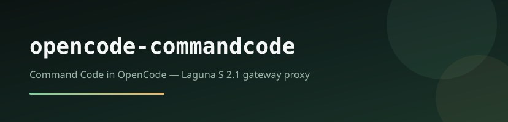

<p align="center">
  
</p>

<p align="center">
  <a href="https://www.npmjs.com/package/@otto-assistant/opencode-commandcode"></a>
  <a href="https://www.npmjs.com/package/@otto-assistant/opencode-commandcode"></a>
  <a href="LICENSE"></a>
  
  <a href="https://github.com/otto-assistant/opencode-commandcode/releases"></a>
</p>

<p align="center">
  <strong>Command Code inside OpenCode</strong> — Go-plan ($1) browser login,<br>
  gateway proxy, free Laguna S 2.1, tools/MCP, attachments, compact, usage.
</p>

<p align="center">
  <a href="#install">Install</a> ·
  <a href="#authenticate">Authenticate</a> ·
  <a href="#why-this-plugin">Why this plugin</a> ·
  <a href="#architecture">Architecture</a> ·
  <a href="CHANGELOG.md">Changelog</a>
</p>

---

Run [Command Code](https://commandcode.ai) models from OpenCode by proxying the same gateway that `npm i -g command-code@latest` uses (`POST /alpha/generate`). Default and exclusive live-test target: **Laguna S 2.1 free** (`poolside/laguna-s-2.1-free`, 256k context, $0).

Plugin shape mirrors [@otto-assistant/opencode-claude](https://github.com/otto-assistant/opencode-claude) and [@otto-assistant/opencode-cursor](https://github.com/otto-assistant/opencode-cursor).

## Install

`command-code` is **not** a built-in OpenCode provider. Install the plugin first, or
`opencode auth login --provider command-code` fails with `Unknown provider "command-code"`.

```bash
# global (recommended)
opencode plugin @otto-assistant/opencode-commandcode -g

# or project-local (writes .opencode/opencode.json)
opencode plugin @otto-assistant/opencode-commandcode
```

Optional provider naming (also seeded when the plugin loads):

```jsonc
{
  "$schema": "https://opencode.ai/config.json",
  "plugin": ["@otto-assistant/opencode-commandcode"],
  "provider": {
    "command-code": { "name": "Command Code" }
  }
}
```

Or build from source:

```bash
git clone https://github.com/otto-assistant/opencode-commandcode.git
cd opencode-commandcode
bun install && bun run build
opencode plugin file://$PWD
```

## Authenticate

Requires the plugin to be installed (see above). Uses the **Command Code Go plan ($1/mo)** — same browser login as `cmd login`. No Studio API key.

```bash
# Option A — sync from Command Code CLI (recommended)
npm i -g command-code@latest
cmd login   # browser → Studio CLI auth (Go plan). Laguna S 2.1 is $0 credits.
opencode auth login --provider command-code
# pick "Use existing cmd login session"

# Option B — browser OAuth (Go $1)
opencode auth login --provider command-code
# pick "Login with Command Code (Go $1)"
```

Then start OpenCode, pick provider **command-code**, and choose Laguna S 2.1 free:

```bash
opencode run "Summarise this repository in five bullets." --model command-code/laguna-s-2.1-free
```

Laguna S 2.1 free requires an active Go (or higher) account with credits on file; requests on that model still bill **$0**.

## Why this plugin

| | |
|---|---|
| **Gateway proxy** | Talks to `api.commandcode.ai/alpha/generate` — same transport as the `cmd` CLI (`mode=agent`). |
| **Laguna S 2.1 free** | 256k context, reasoning, $0 while the deal lasts. Default aliases resolve here. |
| **Go-plan auth** | Browser OAuth like `cmd login` ($1/mo). Syncs `~/.commandcode/auth.json`. No Studio API key. |
| **Agent-grade tools** | OpenCode tool calls park and resume; MCP-prefixed tools are tracked separately. |
| **Attachments** | Images, PDFs, text/binary files from OpenCode. Text-only models get image placeholders (Command Code behavior). |
| **Auto-compact** | Context-fraction tips + tiered client compact before the 256k window overflows. |
| **Usage** | Per-turn and session totals via SSE `usage` + `GET /v1/usage`. |

## Architecture

```text
OpenCode
  └─ /v1/chat/completions
       └─ Bun.serve proxy (port 8797)
            └─ POST https://api.commandcode.ai/alpha/generate
                 └─ poolside/laguna-s-2.1-free (default)
```

Model catalog: aliases `laguna-s-2.1-free` / `laguna` / `default` (and siblings) map to
`poolside/laguna-s-2.1-free`. Auth credentials are mirrored between OpenCode `auth.json`
and `~/.commandcode/auth.json`.

## Requirements

- [OpenCode](https://opencode.ai)
- [Command Code CLI](https://www.npmjs.com/package/command-code) (`npm i -g command-code@latest`) and a Go-plan account
- Bun (plugin runtime) · Node.js ≥ 18 (CLI needs ≥ 22)

## Development

```bash
bun install
bun run build
bun run test          # mocked gateway — attachments, tools, compact, usage
bun run test:live     # live Laguna S 2.1 (needs `cmd login` / Go plan session)
```

Debug logging: `OPENCODE_COMMANDCODE_DEBUG=1`.

Optional knobs:

- `OPENCODE_COMMANDCODE_PROXY_PORT` — fixed local proxy port (default `8797`; must match static config)
- `OPENCODE_COMMANDCODE_CWD` — working directory reported to the gateway
- `COMMANDCODE_API_URL` / `OPENCODE_COMMANDCODE_API_URL` — override API base (default `https://api.commandcode.ai`)

## Release

Publish via GitHub Actions → **Actions → Release → Run workflow**:

| Input | Purpose |
|---|---|
| `version` | Explicit semver (`0.2.0`). Empty → use bump |
| `bump` | `minor` (default) / `patch` / `major` |
| `dry_run` | Skip npm publish; create a draft GitHub release |

Requires repo secrets: `NPM_TOKEN`, optional `DISCORD_WEBHOOK_URL`.

Local pin refresh after a release:

```bash
./scripts/update-plugin.sh
```

## FAQ

**Do I need a Studio API key?**  
No. Use Go-plan browser login (or sync from `cmd login`).

**Is Laguna free?**  
Yes — `poolside/laguna-s-2.1-free` is the default free model ($0 while the deal lasts).

**Why isn’t Command Code listed without the plugin?**  
OpenCode doesn’t ship Command Code as a built-in provider; this plugin registers it.

**Where are releases?**  
[GitHub Releases](https://github.com/otto-assistant/opencode-commandcode/releases) · [npm](https://www.npmjs.com/package/@otto-assistant/opencode-commandcode) · [Changelog](CHANGELOG.md)

## License

[MIT](LICENSE)
